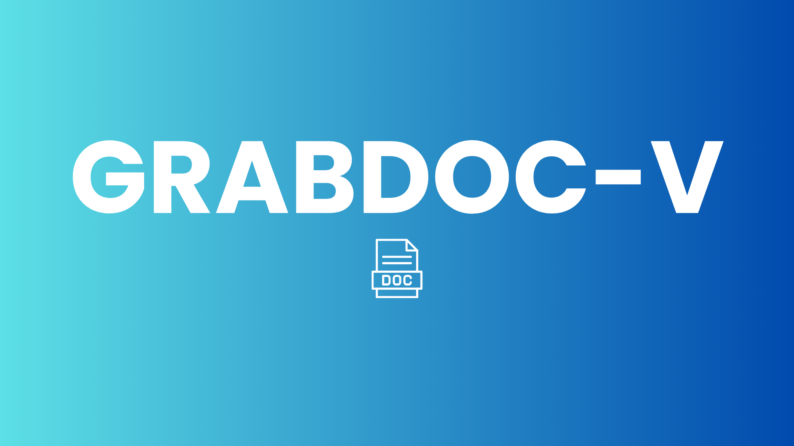

Check out the configuration reference at https://huggingface.co/docs/hub/spaces-config-reference

## Model Details

| Model Identifier                      | Description                                         | Version |
|---------------------------------------|-----------------------------------------------------|---------|
| `meta-llama/Meta-Llama-3.1-70B-Instruct` | A large language model designed for instruction-based tasks, with 70 billion parameters. | 3.1     |





## HTTPS

    Make sure you have git-lfs installed (https://git-lfs.com)
    
    git lfs install
    
    git clone https://huggingface.co/spaces/prithivMLmods/GRABDOC-V
    
    If you want to clone without large files - just their pointers
    
    GIT_LFS_SKIP_SMUDGE=1 git clone https://huggingface.co/spaces/prithivMLmods/GRABDOC-V

## SSH 

    Make sure you have git-lfs installed (https://git-lfs.com)
    
    git lfs install
    
    git clone git@hf.co:spaces/prithivMLmods/GRABDOC-V
    
    If you want to clone without large files - just their pointers
    
    GIT_LFS_SKIP_SMUDGE=1 git clone git@hf.co:spaces/prithivMLmods/GRABDOC-V

## Llama -- Clients

```python
for message in client.chat.completions.create(
    model="meta-llama/Meta-Llama-3.1-70B-Instruct",
    max_tokens=max_tokens,
    stream=True,
    temperature=temperature,
    top_p=top_p,
    messages=messages,
):
```

## DEMO-GIF


## Dependencies

| Package            | Version     | Description                                         |
|--------------------|-------------|-----------------------------------------------------|
| `gradio`           | Latest      | A library for building machine learning demos and applications. |
| `fpdf`             | Latest      | A Python class for generating PDF documents.       |
| `openai`           | Latest      | A library for accessing OpenAI’s API and models.   |
| `python-docx`      | Latest      | A library for creating and updating Microsoft Word (.docx) files. |
| `huggingface-hub`  | 0.24.6      | A library for interacting with the Hugging Face Hub to manage and share machine learning models and datasets. |

.

.

.@prithivmlmods

### **Try It Out!**
| Hugging Face | [prithivMLmods](https://huggingface.co/prithivMLmods) |

